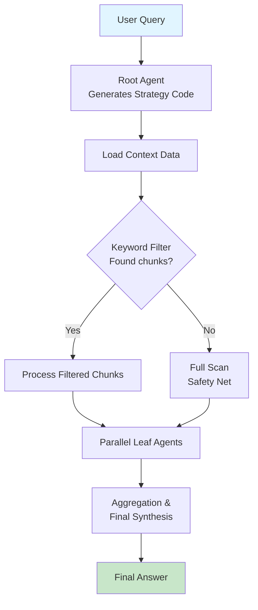

# rlm-bun

[](https://opensource.org/licenses/MIT)
[](https://bun.sh)

> A Bun-based implementation of Recursive Language Models (RLMs) - enabling unbounded context processing through recursive LLM decomposition.

## 🧠 About RLM

This project implements **Recursive Language Models (RLMs)**, a paradigm-shifting approach to long-context reasoning published by MIT CSAIL in December 2025 (arXiv:2512.24601). RLMs enable language models to process arbitrarily long prompts by programmatically decomposing and recursively calling themselves over context snippets, handling inputs up to 100x beyond standard model context windows.

### Key Papers
- [Recursive Language Models - MIT CSAIL (arXiv:2512.24601)](https://arxiv.org/abs/2512.24601)
- [Official Implementation](https://github.com/alexzhang13/rlm)

## ✨ Features

- **Unbounded Context**: Process documents of any size by intelligent chunking and recursion
- **Cost-Effective**: Uses cheaper "leaf" models for analysis and prunes irrelevant chunks with keyword filtering
- **Structured Output**: Enforces JSON responses for programmatic handling
- **Safety Net**: Automatic fallback to full scan if keywords yield no results
- **Bun-Powered**: Built with Bun for maximum performance

## 🏗️ Architecture



## 📦 Installation

```bash
# Clone the repository
git clone <your-repo-url>
cd rlm-bun

# Install dependencies
bun install
```

## ⚙️ Configuration

Copy `.env.example` to `.env` and configure your OpenRouter API keys:

```bash
cp .env.example .env
```

| Variable | Description | Default |
|----------|-------------|---------|
| `OPENROUTER_URL` | OpenRouter API endpoint | https://openrouter.ai/api/v1/chat/completions |
| `OPENROUTER_KEY` | Your OpenRouter API key | - |
| `SITE_URL` | Your site URL for referer header | https://your-site.com |
| `SITE_NAME` | Your project name | Your Project Name |
| `LEAF_MODEL` | Model for chunk analysis | openai/gpt-4o-mini |
| `ROOT_MODEL` | Model for strategy generation | openai/gpt-5-mini |

## 🚀 Usage

### Basic Usage

1. The `data.txt` file is the full Bun documentation (full-llm.txt from Bun docs)
2. Update the file path in `index.ts` (line 170)
3. Run the RLM:

```bash
bun run index.ts
```

### Example Query

The demo queries:
```
"How can I connect and read files from S3 using Bun. Provide a working example code."
```

### Custom Queries

Edit the query in `index.ts` line 172:

```typescript
await rlm.run("Your custom query here")
```

## 🔧 How It Works

### Three Core Optimizations

1. **Structured Output**: Leaf agents return JSON `{ found: boolean, answer: string }`, enabling programmatic filtering of "I don't know" responses.

2. **Smart Keyword Filtering**: The root agent identifies 2-3 broad keywords from the query and filters chunks before expensive LLM analysis.

3. **Safety Net**: If keyword filtering yields 0 chunks, the system automatically falls back to full-document scanning to prevent missing information.

### The Flow

1. **Root Agent** receives user query and generates JavaScript strategy code
2. **Strategy Code** chunks the context (15000 chars, 500 overlap)
3. **Keyword Filter** prunes irrelevant chunks (majority discarded)
4. **Parallel Leaf Agents** analyze filtered chunks concurrently
5. **Aggregation** combines valid answers and synthesizes final response

## 📚 Citation

If you use this implementation or the RLM approach in your research, please cite the original paper:

```bibtex
@misc{zhang2025recursivelanguagemodels,
  title={Recursive Language Models}, 
  author={Alex L. Zhang and Tim Kraska and Omar Khattab},
  year={2025},
  eprint={2512.24601},
  archivePrefix={arXiv},
  primaryClass={cs.AI},
  url={https://arxiv.org/abs/2512.24601}, 
}
```

## 🤝 Contributing

Contributions are welcome! Please see [CONTRIBUTING.md](CONTRIBUTING.md) for guidelines.

## 📄 License

This project is licensed under the MIT License - see [LICENSE](LICENSE) for details.

## 🙏 Acknowledgments

- Original RLM research by [Alex L. Zhang et al.](https://github.com/alexzhang13) at MIT CSAIL
- Built with [Bun](https://bun.sh) runtime
- Powered by [OpenRouter](https://openrouter.ai)
